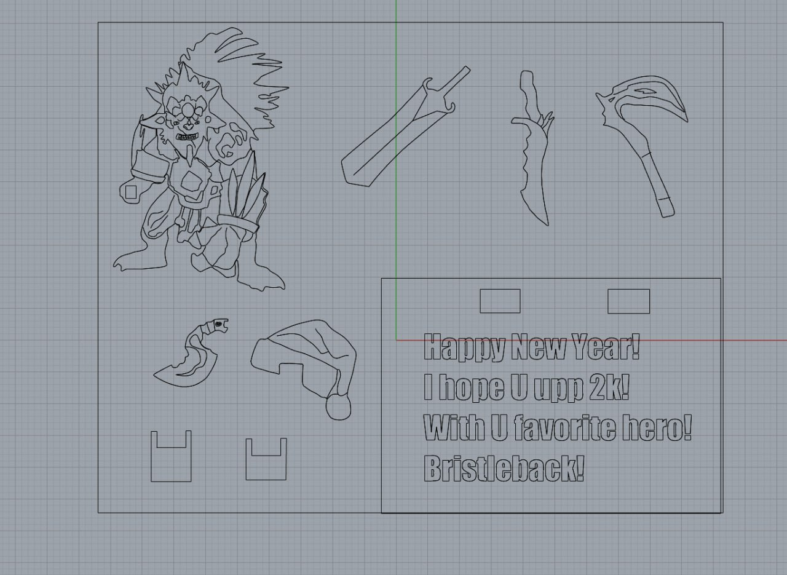
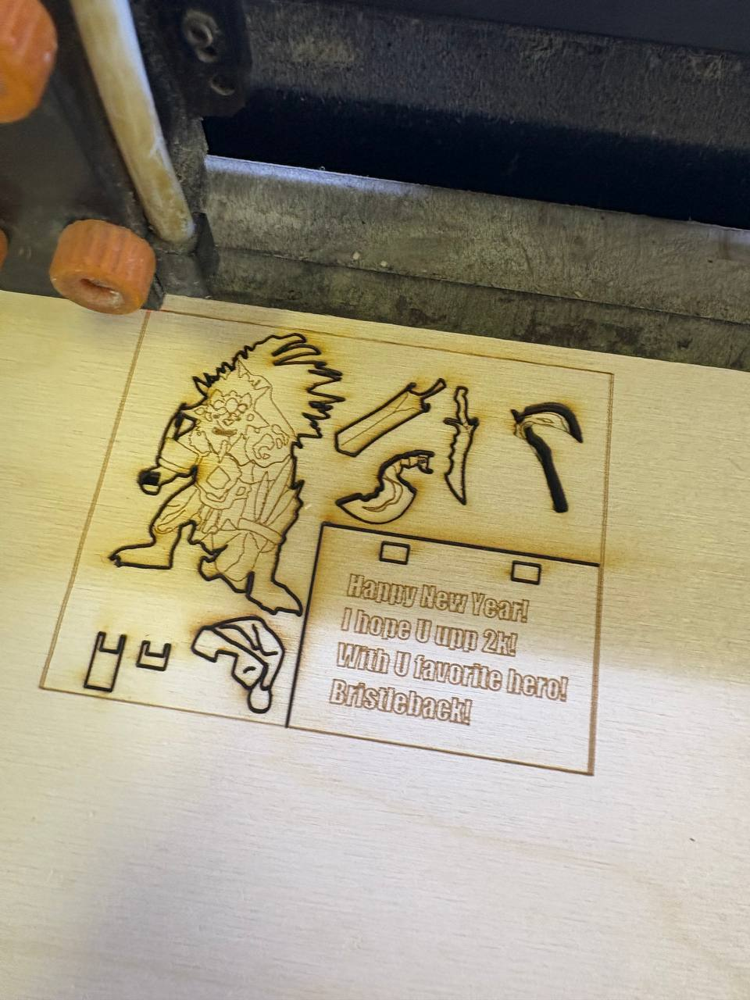
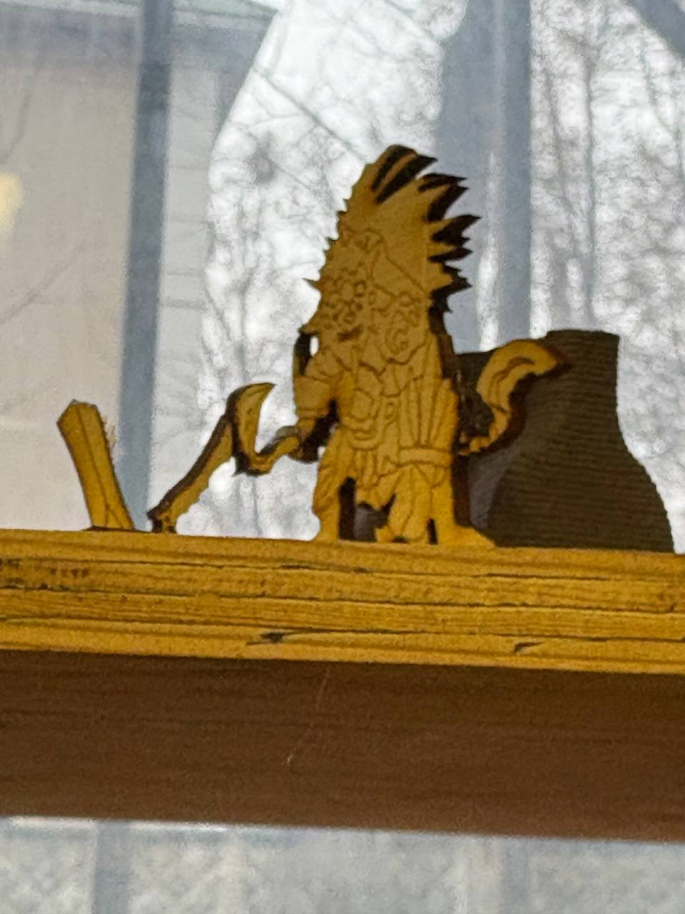

# laser-kit
## ОТЧЕТ ПО ПРАКТИКЕ 1.1 / 1.2
Отчет по практике 1.1/1.2 содержит создание персонажа из Dota 2 для новогоднего подарка моему отцу (6к часов в Dota 2).  
```Задача
Изг-отовление новогоднего набора-конструктора под лазерную резку из фанеры толщиной 3 мм
```
## ТЕХНОЛОГИИ
1. Rhio 8  
2. CarelDrow 2022  
3. Split GSL  
## ХОД РАБОТЫ  
### Создание модели в Rhio:

Модель получилась детально и с большим количеством точек (около 50к - 60к)  
### Вырезка модели на станке Split GSL  
После того как я сделал модель в Rhio, необходимо было вырезать его, файл был перенапревлен из Rhio 8 в CarelDrow 2022.  
Далее был передан на станок "Лазерной резки - Split GSL"  
  
Станок вырезал конечный результат вырезки станка показан на следующем рисунке:  
  
### Сборка
После вырезания необходимо было собрать фигурку, процес был максимально интуитивно понятным и это удалось сделать, как показано на следующем рисунке:  
  
## ИТОГ  
В рамках выполненого заданя был сделана новогодняя фигурка bristle-back-а и подарена отцу.